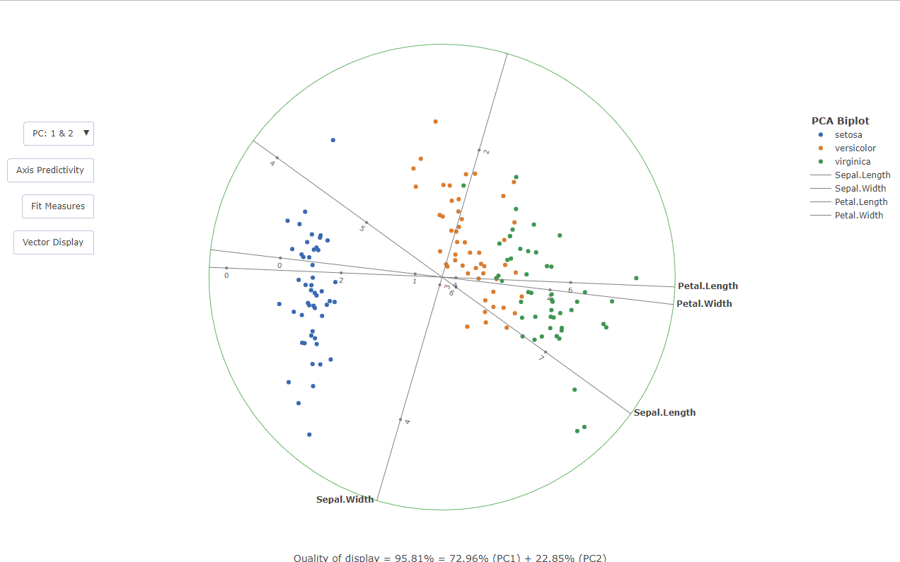
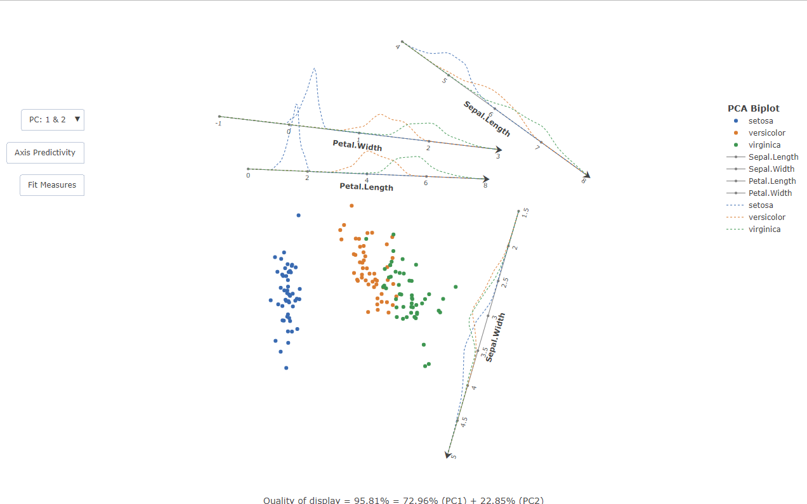

<!-- README.md is generated from README.Rmd. Please edit that file -->

# bipl5

<!-- badges: start -->
<!-- badges: end -->

The goal of bipl5 is to provide a modern take on PCA biplots with
calibrated axes. The biplots are rendered in HTML via the plotly
graphing library, upon which custom JavaScript code is appended to make
the plot reactive. The traditional biplot view is also extended through
an algorithm that translates the axes out of the data centroid,
decluttering the view. In addition to the former, inter-class kernel
densities are superimposed on the axes to give an indication of the data
spread across the variables.

## Installation

You can install the latest version of bipl5 from CRAN with:

``` r
install.packages("bipl5")
library(bipl5)
#> 
#> Welcome to bipl5!
#> 
#> Run help(bipl5) for more information on the package scope.
```

## Example: Traditional PCA biplot

This is a basic example of constructing a traditional PCA biplot with
calibrated axes and vector loadings. In the literature, a square is
often drawn around the biplot purely for aesthetic reasons. This
approached was modified by constructing a circle which bounds the plot:

``` r
PCAbiplot(iris[,-5],group=iris[,5])
#> Call:
#> PCAbiplot(x = iris[, -5], group = iris[, 5])
#> 
#> Data Breakdown:
#>   n: 150 
#>   p: 4
#> 
#> Grouping variable:            
#>              Count
#>   setosa        50
#>   versicolor    50
#>   virginica     50
#> 
#> Fit Statistics:
#> 
#> 
#> Table: Adequacy of the Axes
#> 
#> |         | Sepal.Length| Sepal.Width| Petal.Length| Petal.Width|
#> |:--------|------------:|-----------:|------------:|-----------:|
#> |PC: 1+2: |       0.4140|      0.9250|       0.3375|      0.3235|
#> |PC: 1+3: |       0.7893|      0.1323|       0.3571|      0.7214|
#> |PC: 2+3: |       0.6602|      0.9122|       0.0208|      0.4068|
#> 
#> 
#> Table: Axis Predictivity
#> 
#> |         | Sepal.Length| Sepal.Width| Petal.Length| Petal.Width|
#> |:--------|------------:|-----------:|------------:|-----------:|
#> |PC: 1+2: |       0.9226|      0.9909|       0.9837|      0.9353|
#> |PC: 1+3: |       0.8684|      0.2205|       0.9861|      0.9902|
#> |PC: 2+3: |       0.2062|      0.7880|       0.0035|      0.0631|
#> 
#> Quality of display = 95.81% = 72.96% (PC1) + 22.85% (PC2)
```



On the rendered HTML file there are reactive events embedded on the
plot, such as changing the principal components used for the
scaffolding. More detailed information can be obtained by reading the
help documentation

``` r
?PCAbiplot
```

## Example: Automated Orthogonal Parallel Translation of the axes

The cluttering in the centroid of the biplot can be relieved by the
Orthogonal Parallel Translation of the axes out of the data centroid in
such a way that the correlation structure among variables is retained.
This is done with the following:

``` r
x<-PCAbiplot(iris[,-5],group=iris[,5])
x |> TDAbiplot()
#> [1] 1.008636
#> Call:
#> PCAbiplot(x = iris[, -5], group = iris[, 5]) |> 
#>  TDAbiplot.bipl5(x = x)
#> 
#> Data Breakdown:
#>   n: 150 
#>   p: 4
#> 
#> Grouping variable:            
#>              Count
#>   setosa        50
#>   versicolor    50
#>   virginica     50
#> 
#> Fit Statistics:
#> 
#> 
#> Table: Adequacy of the Axes
#> 
#> |         | Sepal.Length| Sepal.Width| Petal.Length| Petal.Width|
#> |:--------|------------:|-----------:|------------:|-----------:|
#> |PC: 1+2: |       0.4140|      0.9250|       0.3375|      0.3235|
#> |PC: 1+3: |       0.7893|      0.1323|       0.3571|      0.7214|
#> |PC: 2+3: |       0.6602|      0.9122|       0.0208|      0.4068|
#> 
#> 
#> Table: Axis Predictivity
#> 
#> |         | Sepal.Length| Sepal.Width| Petal.Length| Petal.Width|
#> |:--------|------------:|-----------:|------------:|-----------:|
#> |PC: 1+2: |       0.9226|      0.9909|       0.9837|      0.9353|
#> |PC: 1+3: |       0.8684|      0.2205|       0.9861|      0.9902|
#> |PC: 2+3: |       0.2062|      0.7880|       0.0035|      0.0631|
#> 
#> Quality of display = 95.81% = 72.96% (PC1) + 22.85% (PC2)
```


